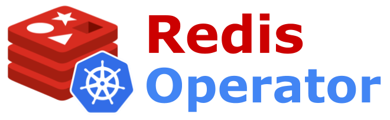
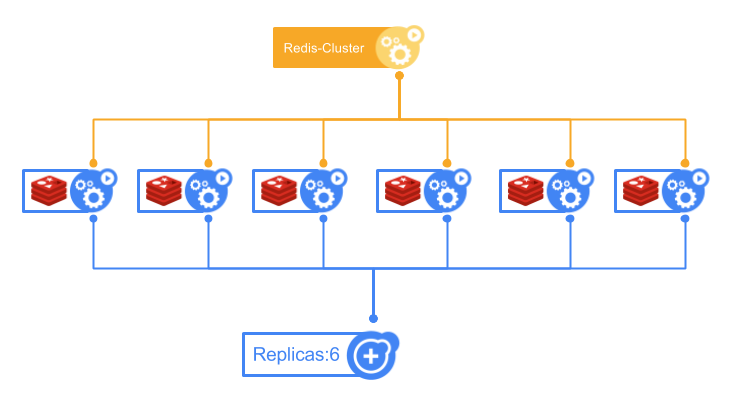

# Redis-Operator



### Build Status
[](https://travis-ci.org/AmadeusITGroup/Redis-Operator)
[](https://goreportcard.com/report/github.com/amadeusitgroup/redis-operator)
[](https://codecov.io/gh/amadeusitgroup/redis-operator)


## Project status: alpha

This is an ongoing project.

The aim of this project is to ease the deployment and operations of a [Redis-cluster](https://redis.io/topics/cluster-tutorial) in a [kubernetes](https://kubernetes.io/) environment. It started internally at Amadeus in 2016, we initially designed this project to run on [Openshift](https://www.openshift.com/). This is the second version of our Redis-Operator that is based now on Kubernetes CustomResourceDefinition (CRD) for representing the RedisCluster configuration.

## Overview

The Redis-cluster will be deployed thanks to a unique deployment. Each node of the Redis-cluster is running in its own Pod; At startup, each node has no active role (not slave nor master with slot), it just joins the cluster as a master without slot. See representation in the schema below 



At this point you have your redis process running, each node is aware of each other, but only one master prossess all slots.

In order to configure properly the different redis-servers and setup the redis cluster, we introduce the `Redis-Operator`.

The `redis-operator` is watching a new kind of Custom-Resource `RedisCluster` that stores the redis-cluster configuration: number of masters, and the replication factor (number of slaves by master) and the pod template. Then the `redis-operator` tries to apply this configuration to the set of redis-server processes. If the number of redis-servers doesn't correspond to the provided configuration, the manager scales the redis-node pods to obtain the proper number of redis-nodes.

Then reconciliation is constantly done between the state of the cluster and the configuration stored in the `RedisCluster` CR.

### Development

If you want to take part of the development, you can follow the document: [CONTRIBUTING.md](CONTRIBUTING.md).

## Deployment

you can found checkt the [docs/cookbook.md](docs/cookbook.md) that is a step by step commands cookbook to test/demo the deployment of the operator and a redis-cluster with minikube.

### Deployment environment requirements

As said, the project was initially designed to works on Openshift, but now support also Kubernetes. Please check the minimum environment version in the table below.

| Environment  | Version |
|--------------|---------|
| Openshift    | >= 3.7  |
| Kubernetes   | >= 1.7  |

### Helm deployment

You can found in the `charts` folder two helm charts:

- `redis-operator`: used to deploy the `redis-operator` into your kubernetes cluster.
- `redis-cluster`: used to create a "Redis Cluster" instance thanks to the `redis-operator`.

#### Instanciate the `redis-operator`:

```console
helm install --name op chart/redis-operator
NAME:   op
LAST DEPLOYED: Tue Jan  9 23:41:13 2018
NAMESPACE: default
STATUS: DEPLOYED

RESOURCES:
==> v1beta1/Deployment
NAME               DESIRED  CURRENT  UP-TO-DATE  AVAILABLE  AGE
op-redis-operator  1        1        1           0          0s
```

TODO: document RBAC support.

#### Create your "Redis-Cluster"

Thanks to the helm chart `chart/redis-cluster` you can create a `RedisCluster` Custom Resource which will be processed by the `redis-operator`.

You can configure the Topology of the cluster by providing your own `values.yml` file to helm, or settings the value with the `--set` parameters when you execute `helm install`

```console
helm install --name mycluster chart/redis-cluster --set numberOfMaster=3 --set replicationFactor=1
...
```

> **! Warning !**, if you want to use the docker images corresponding  to the level of code present in the "master" branch. you need to set the image tag when you instanciate the Redis-Cluster chart and the Redis-Operator chart. The "latest" tag is corresponding to the last validated release.

```console
helm install --name mycluster chart/redis-cluster --set image.tag=master --set numberOfMaster=3 --set replicationFactor=1
...
```

#### Install the kubctl redis-cluster plugin

docs available [here](docs/kubectl-plugin.md).

### Deployment from source code

#### Build the container images

```console
cd $GOPATH/src/github.com/amadeusitgroup/redis-operator
make container
CGO_ENABLED=0 GOOS=linux go build -i -installsuffix cgo -ldflags '-w' -o docker/operator/operator ./cmd/operator/main.go
CGO_ENABLED=0 GOOS=linux go build -i -installsuffix cgo -ldflags '-w' -o docker/redisnode/redisnode ./cmd/redisnode/main.go
```

you can define the docker images tag by adding the variable "VERSION"

```console
make TAG=<Your-TAG> container
```

publish the docker images in your docker registry

```console
make TAG=<Your-TAG> publish
```

In addition to the version, you can also specify the docker registry where will be publish the docker images with the variable DOCKER_REGISTRY

```console
make DOCKER_REGISTRY="mydockerregistry:5000/" TAG=<Your-TAG> publish
```

### How to Release the Redis-Operator

This project is using [goreleaser](https://goreleaser.com/) and an additional script for releasing also the Helm chart.

For starting the delivery, you need to clone this repository, then:

```console
zsh hack/release.sh <version> <remove-git>
```

a concreate example is: ```zsh ./hack/release.sh v1.0.1 upstream```

This script:

- generates locally the helm chart with the requested version.
- updates the helm repo index file (```docs/index.yaml```) file with the new release.
- creates a new changeset with all changes generated by the new release version, then tag this changeset.
- push changeset and associated tag to the remote git repository.
